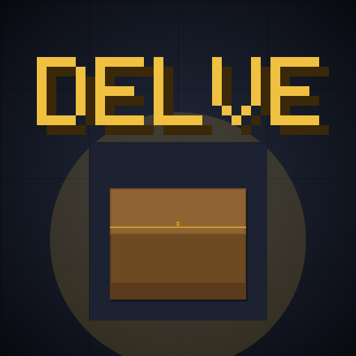

# DELVE — The Sunken Keep

A retro, Zelda-inspired dungeon puzzle game. Push blocks onto ancient
switches, claim lost relics, and descend to the Sunstone — then keep
delving forever in procedurally generated depths.



## Game modes

- **Story** — 31 handcrafted levels across 5 chapters. Progress is gated
  by relics found in chests: the Guard's Blade (cuts bramble), Warden's
  Shield (walk through flame), Titan Glove (push iron), and Pale Lantern
  (light the Lightless Deep).
- **Challenge** — endless procedurally generated depths with a move
  budget per floor. Run ends when the moves run out. Local top-10
  leaderboard by deepest delve.
- **Timed Rush** — a 5-vault generated gauntlet against the clock.
  Local top-10 leaderboard by fastest run.

Plus a coin shop: hero skins, dungeon themes, and hint scrolls.

## Running it

It's a dependency-free static page:

```sh
npx serve .        # or any static file server
```

Open on a phone-sized viewport for the intended experience. Keyboard
controls on desktop: arrows/WASD move, Z/Enter confirm, X/Esc back,
U undo, R reset, H is on-screen only.

## Architecture

| File | Role |
|---|---|
| `js/engine.js` | Pure puzzle logic (no rendering; runs in Node for tests) |
| `js/gen.js` | Reverse-pull procedural generator + fast push-solver |
| `js/levels.js` | Story campaign data (maps, narrative, chests) |
| `js/art.js` | All procedural tile/entity pixel art + hero sprite sheet + skins/themes |
| `js/font.js` | 5×7 bitmap pixel font renderer |
| `js/audio.js` | WebAudio chiptune synth: all SFX + music, no audio files |
| `js/save.js` | localStorage persistence, economy, leaderboards |
| `js/screens.js` | Title, onboarding, menu, story select, settings |
| `js/game.js` | The gameplay screen (all three modes) |
| `js/modes.js` | Challenge/Timed lobbies + leaderboards |
| `js/shop.js` | Shop screen |
| `js/platform.js` | Native-bridge stubs (IAP, ads, Game Center, haptics) |
| `js/main.js` | App shell: screen manager, input, render loop |

Every story level is verified solvable by a BFS solver in CI-style
tests, and generated levels are solvable by construction (reverse-pull
scrambling from the solved state).

## Testing

```sh
node tests/levels.test.js   # solver-verifies all 31 story levels + mechanics
```

Browser E2E smoke tests (Playwright) live outside the repo in dev
scratchpads; they walk every screen and flow.

## Shipping to iOS

See [TESTFLIGHT.md](TESTFLIGHT.md) for the Capacitor packaging guide and
[MONETIZATION.md](MONETIZATION.md) for the revenue model.
